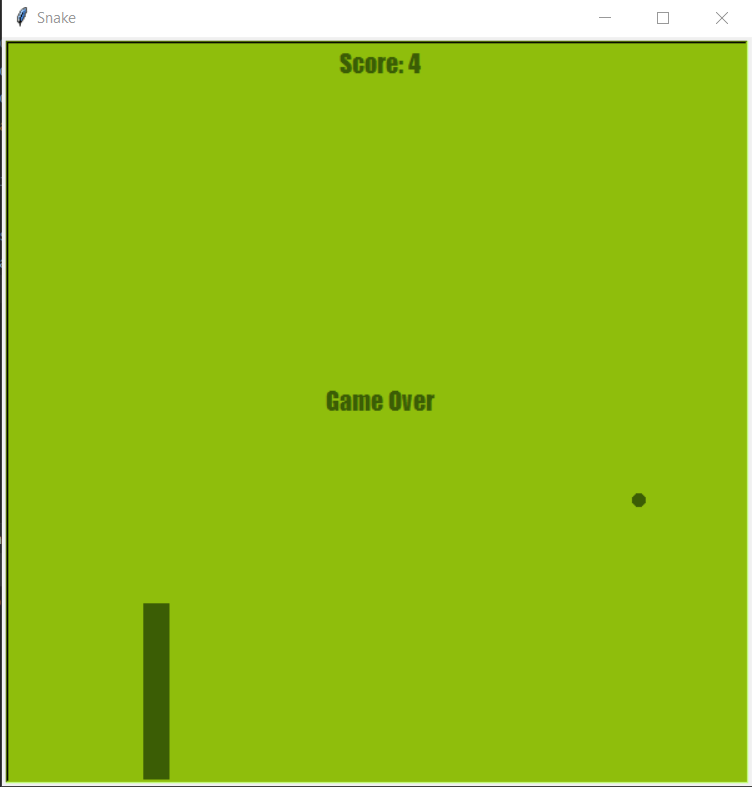

    _____/\\\\\\\\\\\____/\\\\\_____/\\\_____/\\\\\\\\\_____/\\\________/\\\__/\\\\\\\\\\\\\\\_        
    ___/\\\/////////\\\_\/\\\\\\___\/\\\___/\\\\\\\\\\\\\__\/\\\_____/\\\//__\/\\\///////////__       
     __\//\\\______\///__\/\\\/\\\__\/\\\__/\\\/////////\\\_\/\\\__/\\\//_____\/\\\_____________      
     ___\////\\\_________\/\\\//\\\_\/\\\_\/\\\_______\/\\\_\/\\\\\\//\\\_____\/\\\\\\\\\\\_____     
        ______\////\\\______\/\\\\//\\\\/\\\_\/\\\\\\\\\\\\\\\_\/\\\//_\//\\\____\/\\\///////______    
         _________\////\\\___\/\\\_\//\\\/\\\_\/\\\/////////\\\_\/\\\____\//\\\___\/\\\_____________   
          __/\\\______\//\\\__\/\\\__\//\\\\\\_\/\\\_______\/\\\_\/\\\_____\//\\\__\/\\\_____________  
           _\///\\\\\\\\\\\/___\/\\\___\//\\\\\_\/\\\_______\/\\\_\/\\\______\//\\\_\/\\\\\\\\\\\\\\\_ 
            ___\///////////_____\///_____\/////__\///________\///__\///________\///__\///////////////__

Recreating the classic snake game using python and OOP. 

 

